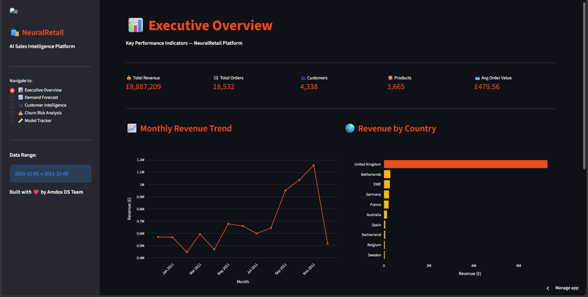
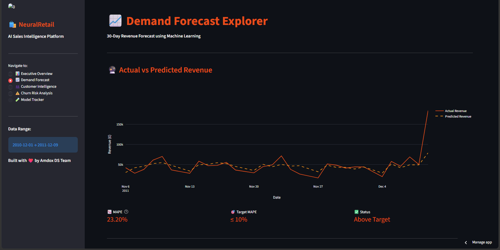
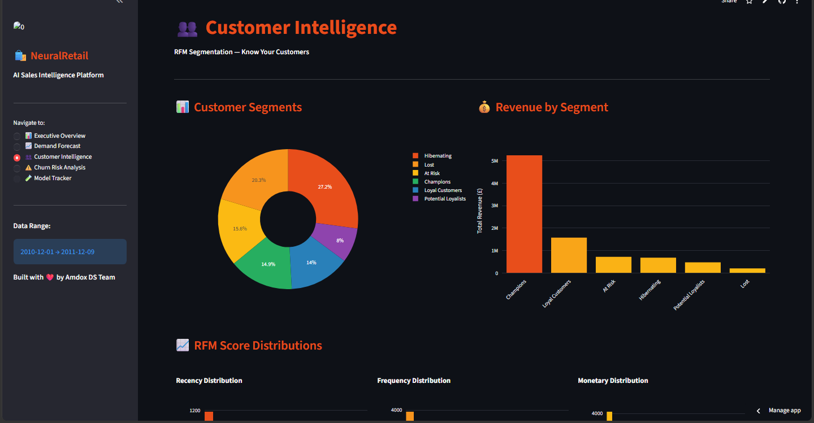
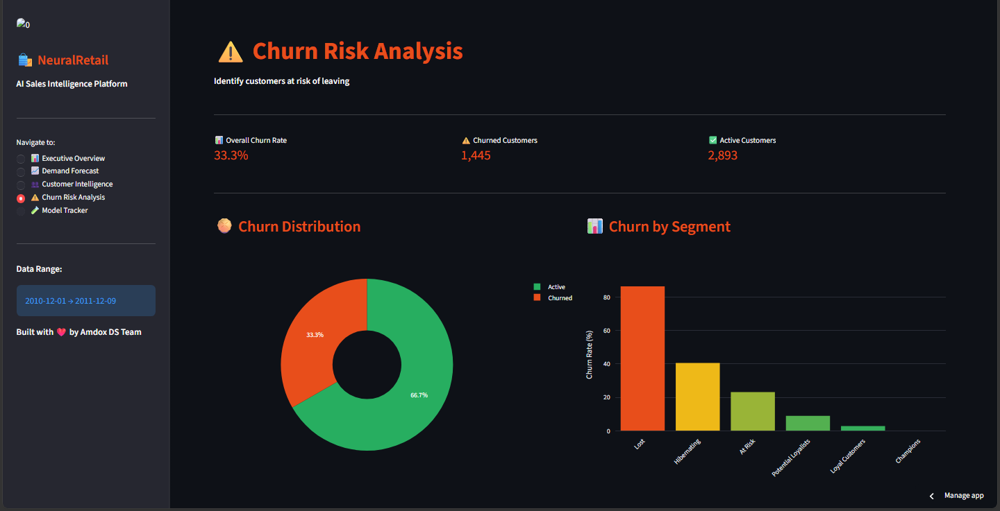
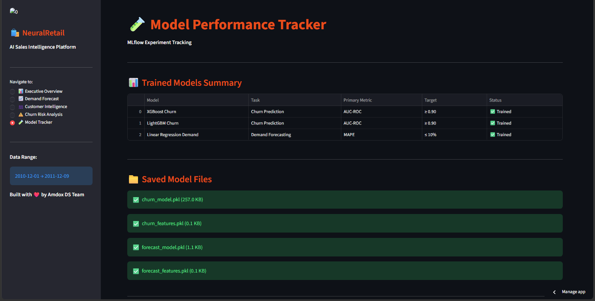

# 🛍️ NeuralRetail — AI Sales Intelligence Platform

<p align="center">
  <a href="https://neuralretail-amdox.streamlit.app">
    
  </a>
  <a href="https://github.com/shubhamjais04/NeuralRetail">
    
  </a>
  
  
  
</p>

---

## 📌 Project Overview

**NeuralRetail** is an end-to-end AI-powered sales intelligence platform built during my Data Science internship at **Amdox Technologies**. It ingests retail transactional data to produce demand forecasts, customer segmentation, churn predictions, and model tracking — all served through an interactive 5-page Streamlit dashboard and a REST API.

> **Dataset:** UCI Online Retail Dataset — 541,909 transactions across 38 countries (2010–2011)

---

## 🎯 Business Impact

| Objective | Algorithm | Metric | Target |
|-----------|-----------|--------|--------|
| Churn Reduction | XGBoost + LightGBM | AUC-ROC | ≥ 0.90 |
| Forecast Accuracy | Linear Regression + Lag Features | MAPE | ≤ 10% |
| Customer Segmentation | K-Means RFM | Silhouette Score | ≥ 0.55 |

---

## 📸 Dashboard Screenshots

### 📊 Executive Overview — KPIs & Revenue Trends


---

### 📈 Demand Forecast — Actual vs Predicted Revenue


---

### 👥 Customer Intelligence — RFM Segmentation


---

### ⚠️ Churn Risk Analysis — Risk Levels & SHAP Explainability


---

### 🧪 Model Tracker — MLflow Experiments & Model Files


---

## 🤖 ML Models

| Model | Task | Algorithm | Metric |
|-------|------|-----------|--------|
| Churn Prediction | Classification | XGBoost + LightGBM | AUC-ROC |
| Demand Forecasting | Regression | Linear Regression + Lag Features | MAPE |
| Customer Segmentation | Clustering | K-Means RFM | Silhouette Score |

---

## 🏗️ Project Structure

```
NeuralRetail/
├── assets/
│   └── screenshots/          ← Dashboard screenshots
├── data/
│   ├── online_retail_clean.csv
│   ├── rfm_features.csv
│   ├── daily_sales_features.csv
│   ├── forecast_results.csv
│   └── Online_Retail.xlsx
├── notebooks/
│   ├── 01_EDA.ipynb
│   ├── 02_feature_engineering.ipynb
│   ├── 03_model_training.ipynb
│   └── 04_drift_detection.ipynb
├── src/
│   ├── api/                  ← FastAPI REST API
│   ├── features/
│   ├── ingestion/
│   └── models/               ← Trained .pkl model files
├── dashboard/
│   ├── app.py                ← Main Streamlit dashboard
│   └── requirements.txt
├── evidently_reports/        ← Drift detection reports
├── mlflow_runs/              ← MLflow experiment tracking
├── requirements.txt
└── README.md
```

---

## 🚀 How to Run Locally

### 1. Clone the repo
```bash
git clone https://github.com/shubhamjais04/NeuralRetail.git
cd NeuralRetail
```

### 2. Create virtual environment
```bash
py -3.12 -m venv venv
venv\Scripts\activate
pip install -r requirements.txt
```

### 3. Run the notebooks in order
```
notebooks/01_EDA.ipynb
notebooks/02_feature_engineering.ipynb
notebooks/03_model_training.ipynb
notebooks/04_drift_detection.ipynb
```

### 4. Launch the dashboard
```bash
cd dashboard
streamlit run app.py
```

### 5. Launch the API
```bash
cd src/api
uvicorn main:app --reload --port 8000
```
API docs available at: `http://localhost:8000/docs`

---

## 🛠️ Tech Stack

| Layer | Technology |
|-------|------------|
| Language | Python 3.12 |
| ML Models | XGBoost, LightGBM, Scikit-learn |
| Explainability | SHAP |
| Forecasting | Linear Regression + Lag Features |
| Experiment Tracking | MLflow |
| Drift Detection | Evidently AI |
| Dashboard | Streamlit + Plotly |
| API | FastAPI + Uvicorn |
| Data Processing | Pandas, NumPy |

---

## 🌐 Live Demo

👉 **[neuralretail-amdox.streamlit.app](https://neuralretail-amdox.streamlit.app)**

---

## 👨‍💻 Author

**Shubham Jaiswal**
Data Science & Analytics Intern — Amdox Technologies

[](https://github.com/shubhamjais04)
[](https://www.linkedin.com/in/shubhamjaiswal04)
